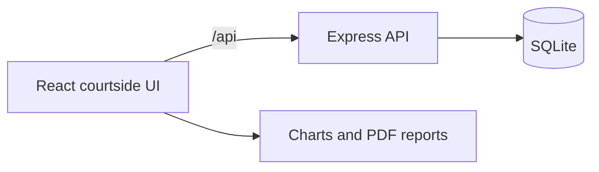

<div align="center">
  

  # COURTSIDE

  **Live stats for Auburn wheelchair basketball.**

  Track a game from the sideline, manage lineups, map every shot, and turn the final buzzer into a box score before the chairs leave the court.

  
  
  
  
</div>

---

## Built for courtside work

COURTSIDE keeps game-day input quick and post-game analysis close at hand. Coaches can record shots by tapping the court, make substitutions, monitor the 14-point lineup classification limit, and review player or season performance from the same local app.

| During the game | After the game |
| --- | --- |
| Tap-to-place made and missed shots | Full box scores |
| Assists, rebounds, steals, turnovers, blocks, fouls, and free throws | Player and season averages |
| Five-player lineup and substitution management | Shot charts by player, team, and zone |
| Opponent scoring and optional player tracking | Printable PDF reports |

## How it fits together



The React app uses TanStack Query for server state. Express handles the REST API, and SQLite stores players, games, and stat events in WAL mode. In Docker, Nginx serves the frontend and proxies `/api` to Express.

## Run it locally

You will need Node.js 20 or newer and npm 9 or newer.

```bash
# Install frontend and API dependencies
npm install
cd api && npm install && cd ..

# Terminal 1: start the API on localhost:7071
cd api && npm start

# Terminal 2: start the app on localhost:5173
npm run dev
```

Open [http://localhost:5173](http://localhost:5173).

### Add sample data

With the API running:

```bash
npm run seed
```

The seed script adds seven anonymous players, five games, and roughly 126 stat events so every view has something useful to show.

## Run with Docker

```bash
# Local build
docker compose up --build

# Detached production-style stack
docker compose -f docker-compose.prod.yml up -d
```

The Docker stack serves COURTSIDE on [http://localhost](http://localhost) and keeps the SQLite database in a named volume.

## Game-day workflow

1. Add the roster under **Players**.
2. Create a game and mark it live.
3. Set the five-player lineup.
4. Select a player, then tap the court to record a shot.
5. Use the quick-stat controls for the rest of the possession.
6. Mark the game complete and review the box score, shot chart, or PDF report.

## App routes

| Route | Purpose |
| --- | --- |
| `/Games` | Schedule and game management |
| `/LiveGame` | Courtside tracking surface |
| `/Dashboard` | Team-level trends and KPIs |
| `/BoxScore` | Per-game stat table |
| `/SeasonAverages` | Aggregated season performance |
| `/Players` | Roster management |
| `/PlayerDetail` | Player history and shot chart |
| `/RecruitingProfile` | Shareable player summary |

## API at a glance

All endpoints live under `/api`.

| Resource | Endpoints |
| --- | --- |
| Games | `GET/POST /games`, `GET/PUT/DELETE /games/:id` |
| Players | `GET/POST /players`, `GET/PUT/DELETE /players/:id` |
| Events | `GET/POST /events`, `GET/PUT/DELETE /events/:id` |
| Health | `GET /health` |

List endpoints accept resource-specific filters and `?sort=field`; prefix the field with `-` for descending order. Event lists also accept `?limit=`.

## Project map

```text
.
├── src/
│   ├── api/          API client
│   ├── components/   Court, lineup, charts, stats, and UI primitives
│   ├── lib/          Auth stub, query client, and stat calculations
│   └── pages/        Route-level screens
├── api/
│   └── src/functions/
│       ├── index.js  Express routes
│       └── db.js     SQLite schema and connection
├── entities/         Data-model references
├── scripts/seed.js   Anonymous sample dataset
└── docker-compose.yml
```

## Useful commands

| Command | What it does |
| --- | --- |
| `npm run dev` | Start Vite with hot reload |
| `npm run build` | Create a production frontend build |
| `npm run lint` | Run ESLint |
| `npm run typecheck` | Check JavaScript through TypeScript |
| `npm run seed` | Load anonymous sample data into the running API |
| `cd api && npm run dev` | Run Express in watch mode |

## Current boundaries

COURTSIDE is configured for trusted local use. Authentication is represented by a stub, and the API accepts requests without user or role checks. Add authentication, authorization, API validation, restricted CORS, and an intentional data-retention policy before exposing the service to the public internet or storing a real roster on a shared server.

Player status is currently global rather than game-specific. A substitution changes that player's status across the app.

---

<div align="center">
  Built for the speed of the game: one tap, one event, no paper reconstruction afterward.
</div>
